<h1 style="font-family: Arial; text-align: center">Rvia</h1>
<h2>Descripcion</h2>  
     
 

Rvia es un sistema web que tiene como objetivo servir de intermediario entre un posible candidato a un puesto disponible en una determinada empresa y la parte de recursos humanos, en el sistema el candidato puede ver el estado de su solicitud, como también su información personal, académica y laboral. La parte de recursos humanos puede ver todos candidatos que han aplicado a un puesto de trabajo, como también pueden ponerse en contacto con cada uno de ellos y emplearlos si así lo desean. La parte administrativa maneja distintos aspectos, como la cantidad de puestos disponibles, los empleados, etc.
  

<h2>Tecnologias usadas<h2>
  <h3 style="display: inline; font-family: Arial">Lenguaje de programacion:</h3>
 
  

  <ul> 
    <li>Java</li>
  </ul>
  

 

 
 <h3 style="display: inline; font-family: Arial">Framework:</h3>
  
  
 
    <ul>
      <li>JavaServer Faces</li>
    </ul>
  

  
  <h3 style="display: inline; font-family: Arial">Herramienta para gestión y construcción de software:</h3>
  
  
 
    <ul>
      <li>Maven</li>
    </ul>
  

  
 
  <h3 style="display: inline; font-family: Arial">Librerias:</h3>
  
  
 
    <ul>
      <li>PrimeFaces</li>
       <li>JQuery</li>
    </ul>
  

  
  <h3 style="display: inline; font-family: Arial">APIs:</h3>
  
  
 
    <ul>
      <li>JPA</li>
      <li>iText</li>
      <li>Java Mail</li>
    </ul>
  

  
 <h3 style="display: inline; font-family: Arial">Sistema gestor de bases de datos:</h3>
  
  
 
    <ul>
      <li>MySQL</li>
    </ul>
  

   
  <h3 style="display: inline; font-family: Arial">Entorno de desarrollo:</h3>
  
  
    <ul>
       <li>NetBeans</li>
       <li>MySQL Workbench</li>
    </ul>
  
    

<h1>Screenshots de la aplicacion</h1>

<h3 style="display: inline; font-family: Arial">Pantalla inicial</h3>
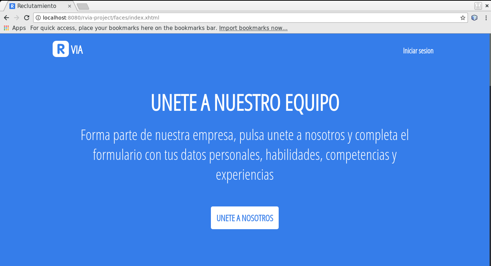
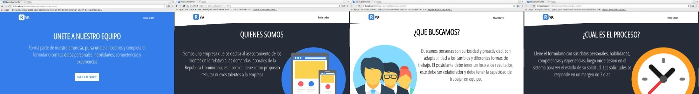

<h3 style="display: inline; font-family: Arial">Pantalla de inicio de sesion</h3> 
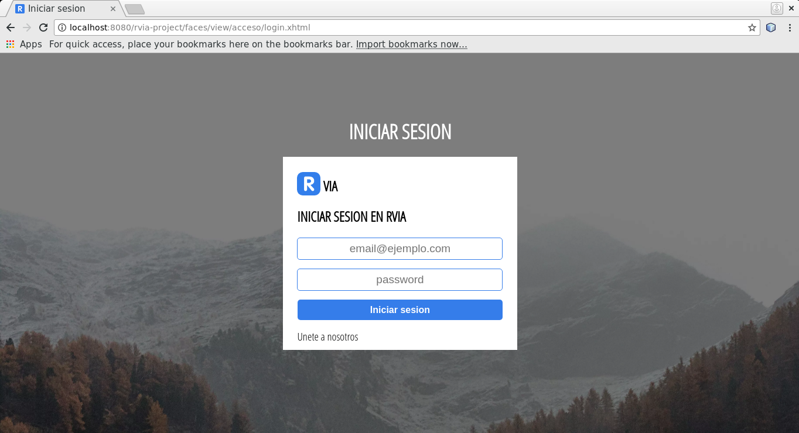

<h3 style="display: inline; font-family: Arial">Pantalla de inicio de sesion validaciones</h3> 
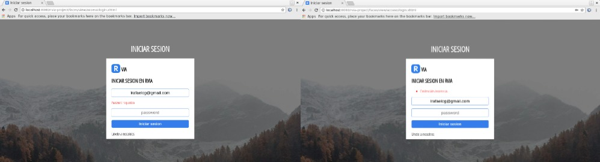

<h3 style="display: inline; font-family: Arial">Pantalla de reclutacion, vista para postulantes</h3> 
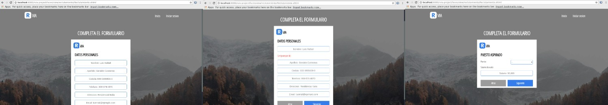
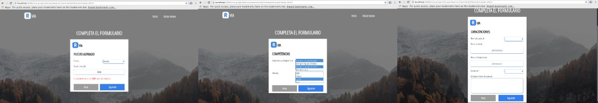
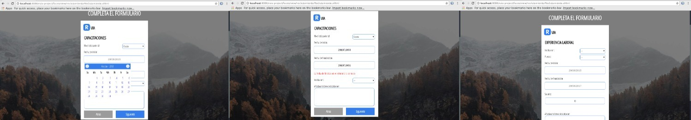

<h3 style="display: inline; font-family: Arial">Pantalla de reclutacion, vista para postulantes creado</h3> 
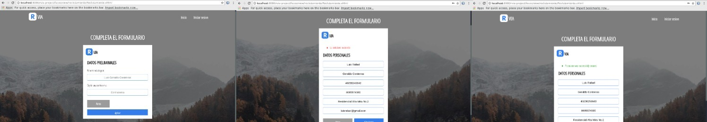

<h3 style="display: inline; font-family: Arial">Vista del postulante cuando inicia sesion</h3> 
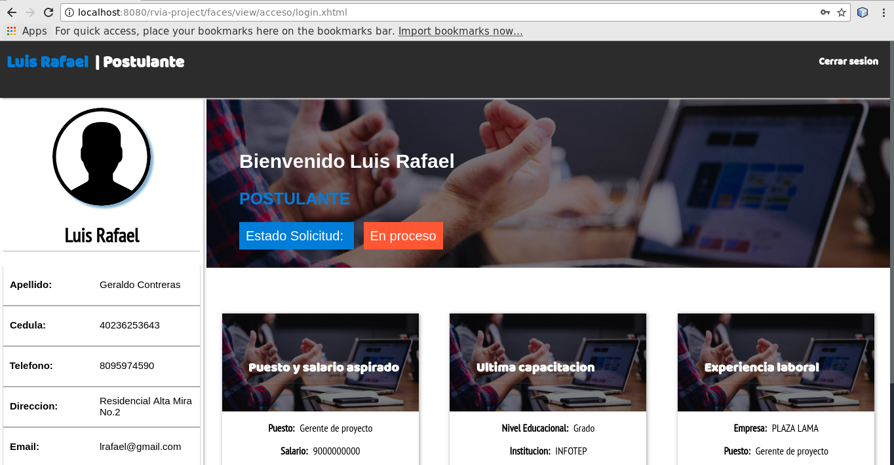

<h3 style="display: inline; font-family: Arial">Vista del administrador cuando inicia sesion</h3> 
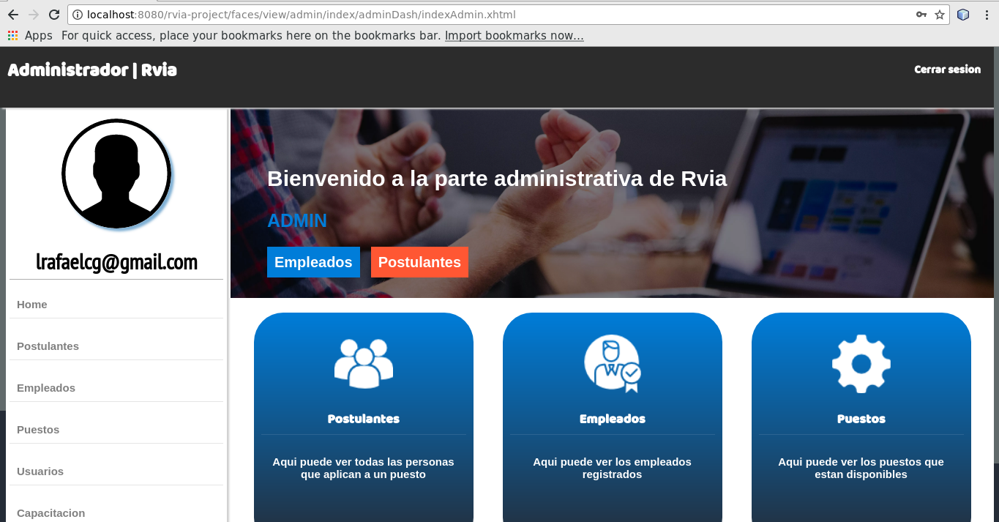

<h3 style="display: inline; font-family: Arial">Lista de postulantes registrados</h3> 
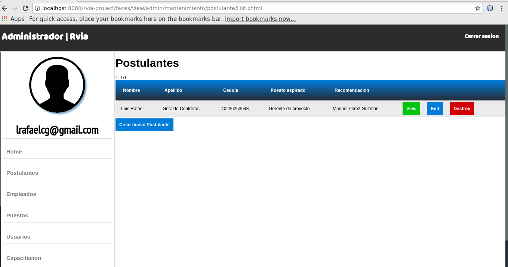

<h3 style="display: inline; font-family: Arial">Vista donde el administrador puede ver el detalle de los postulantes</h3> 
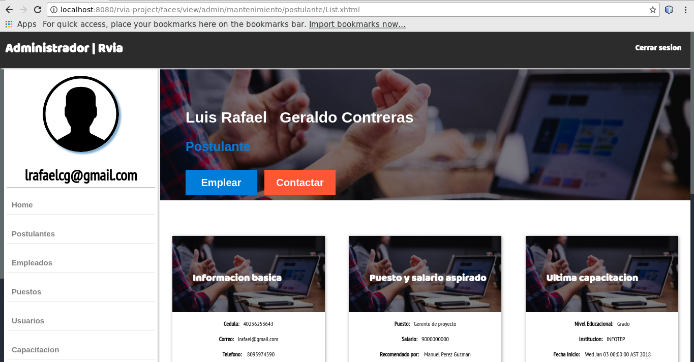

<h3 style="display: inline; font-family: Arial">Proceso de contactar un postulante y convertirlo a empleado</h3> 
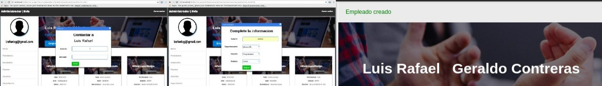

<h3 style="display: inline; font-family: Arial">Lista de empleados</h3> 
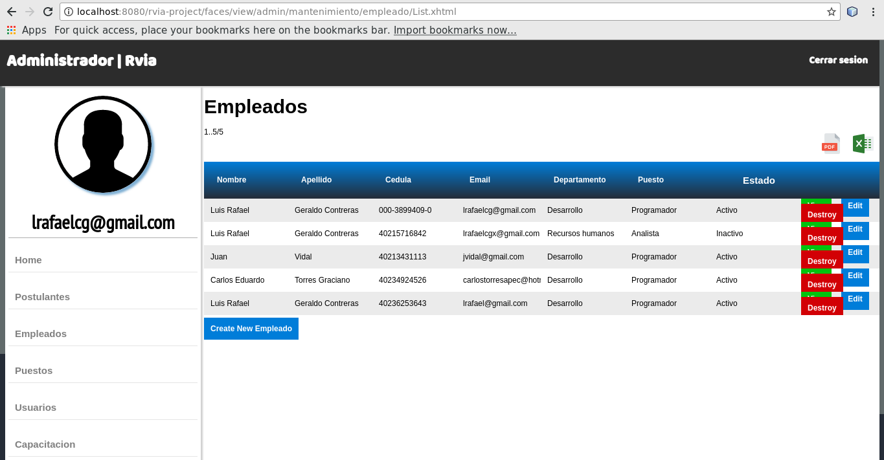

<h3 style="display: inline; font-family: Arial">Correo de contacto al postulante</h3> 
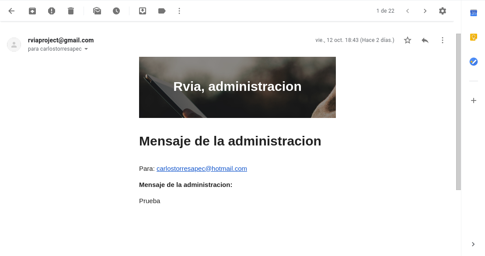
